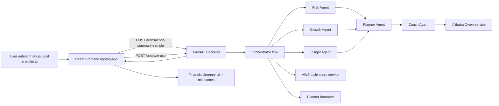
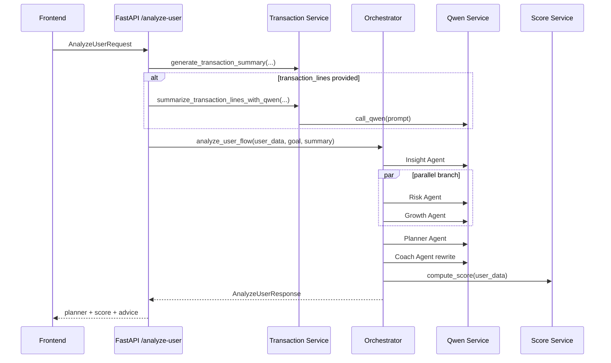

# TNGFinHack

AI-powered financial coaching and planning demo for Touch 'n Go style wallet journeys, with:

- a **FastAPI + multi-agent backend** in `backend/`
- a **React + Vite wallet frontend** in `my-tng-app/`

The app helps turn user financial context and transaction patterns into practical guidance, readiness scoring, and milestone-based action plans mapped to TNG facilities (GO+, GOinvest, GOpinjam, GOinsure).

---

## Table of contents

- [1) What this project does](#1-what-this-project-does)
- [2) Key features](#2-key-features)
- [3) Architecture](#3-architecture)
- [4) Repository structure](#4-repository-structure)
- [5) Setup and run](#5-setup-and-run)
- [6) API reference (backend)](#6-api-reference-backend)
- [7) Frontend integration notes](#7-frontend-integration-notes)
- [8) Configuration](#8-configuration)
- [9) Troubleshooting](#9-troubleshooting)
- [10) Future improvements](#10-future-improvements)

---

## 1) What this project does

### Problem

Financially underserved users can struggle with loan readiness due to irregular cashflow, debt pressure, limited planning support, and low confidence.

### Solution

This project combines deterministic transaction summarization with an AI multi-agent pipeline to produce:

- behavior insights,
- risk review,
- growth recommendations,
- staged milestone plans,
- coach-style final advice,
- and a numeric readiness score.

The frontend presents the output as a mobile-style “financial journey” experience with progress tracking and facility shortcuts.

---

## 2) Key features

### Backend (`backend/`)

- **FastAPI service** with CORS enabled and health endpoint.
- **Multi-agent orchestration flow**:
	- Insight agent
	- Risk agent
	- Growth agent
	- Planner agent
	- Coach agent
- **Parallel reasoning** for Risk + Growth agents.
- **Transaction analysis endpoints**:
	- generated mock transactions from user background,
	- line-based transaction summary via Qwen,
	- sample-file transaction summary from `backend/mock_data/`.
- **Planner compaction layer** that transforms free-text agent outputs into UI-ready structure:
	- headline,
	- quick summary,
	- guardrails,
	- milestones,
	- stages.
- **Facility-aware guidance** grounded with `backend/app/knowledge/tng_facilities.json`.
- **Mock-safe behavior**: if Qwen key is missing/fails, backend still returns fallback guidance.

### Frontend (`my-tng-app/`)

- React single-page wallet experience (`src/TNGWallet.jsx`).
- Planner API integration through `src/api/plannerApi.js`.
- Calls `POST /transaction-summary-sample` + `POST /analyze-user`.
- Displays:
	- readiness score,
	- quick insights,
	- guardrails,
	- milestone timeline,
	- facility-aware CTAs.
- Offline fallback milestones if backend call fails.
- Planner state persisted in `localStorage` (`tng-wallet-planner-v1`).

---

## 3) Architecture

### 3.1 End-to-end flow



### 3.2 Backend orchestration sequence



### 3.3 Backend component map

- `backend/app/main.py` — app bootstrap, logging, CORS, router registration.
- `backend/app/routes/analyze.py` — analyze endpoint and orchestration trigger.
- `backend/app/routes/transactions.py` — transaction summary endpoints.
- `backend/app/orchestrator/flow.py` — multi-agent flow with parallelism.
- `backend/app/orchestrator/planner_formatter.py` — UI-friendly planner output shaping.
- `backend/app/agents/*.py` — specialized agent prompts/roles.
- `backend/app/services/qwen_service.py` — Qwen API calls + fallback responses.
- `backend/app/services/aws_service.py` — demo readiness score logic.
- `backend/app/services/transaction_service.py` — deterministic transaction generation/parsing.
- `backend/app/models/schemas.py` — request/response Pydantic contracts.

---

## 4) Repository structure

```text
TngFInHack/
├── README.md                         # this file
├── gradio_app.py                     # optional standalone demo UI
├── requirements.txt                  # gradio demo dependencies
├── backend/
│   ├── .env.example
│   ├── requirements.txt
│   ├── app/
│   │   ├── main.py
│   │   ├── agents/
│   │   ├── knowledge/
│   │   ├── models/
│   │   ├── orchestrator/
│   │   ├── routes/
│   │   └── services/
│   └── mock_data/
└── my-tng-app/
		├── .env.example
		├── package.json
		└── src/
				├── TNGWallet.jsx
				└── api/plannerApi.js
```

---

## 5) Setup and run

### Prerequisites

- Python 3.10+ (project currently includes a Python 3.13 venv folder)
- Node.js 18+
- npm (or compatible package manager)

### 5.1 Backend setup (`backend/`)

```bash
cd backend
python3 -m venv .venv
source .venv/bin/activate
pip install -r requirements.txt
cp .env.example .env
uvicorn app.main:app --reload --port 8000
```

Backend API docs:

- Swagger: `http://localhost:8000/docs`
- Health: `http://localhost:8000/health`

### 5.2 Frontend setup (`my-tng-app/`)

In a second terminal:

```bash
cd my-tng-app
npm install
cp .env.example .env
npm run dev
```

Then open the Vite URL shown in the terminal (commonly `http://localhost:5173`).

### 5.3 Quick local demo flow

1. Start backend.
2. Start frontend.
3. In wallet UI, set or keep a goal and save/refine it.
4. Frontend calls backend planner APIs and renders a journey timeline.

---

## 6) API reference (backend)

### Base URL

`http://localhost:8000`

### Endpoints

- `GET /health`
- `POST /transaction-summary`
- `POST /transaction-summary-lines`
- `POST /transaction-summary-sample`
- `POST /analyze-user`

### Example: `POST /analyze-user`

Request:

```json
{
	"user_background": {
		"occupation": "Freelancer",
		"monthly_income": 4200,
		"monthly_expenses": 3100,
		"savings_balance": 2500,
		"existing_debt": 900,
		"risk_tolerance": "medium",
		"notes": "Income can fluctuate each month"
	},
	"goal": "Apply motorcycle loan of RM10,000 in one year",
	"months": 3,
	"transactions_per_month": 18
}
```

Response shape:

```json
{
	"insights": "...",
	"risk": "...",
	"growth": "...",
	"plan": "...",
	"final_advice": "...",
	"transaction_summary": "...",
	"score": 72,
	"planner": {
		"headline": "...",
		"goal": "...",
		"progress": 0,
		"score": 72,
		"quick_summary": ["..."],
		"guardrails": ["..."],
		"milestones": [
			{
				"title": "...",
				"hint": "...",
				"status": "in_progress",
				"optional": false,
				"facility": "GO+",
				"action_label": "Open GO+"
			}
		],
		"stages": [
			{
				"title": "Short-Term",
				"timeframe": "1-2 months",
				"steps": ["..."]
			}
		]
	}
}
```

---

## 7) Frontend integration notes

- API wrapper: `my-tng-app/src/api/plannerApi.js`
- Main screen/component: `my-tng-app/src/TNGWallet.jsx`
- Behavior summary:
	- Fetches sample transaction summary from `transaction_lines_sample.txt`.
	- Calls `/analyze-user` with user goal + generated background payload.
	- Normalizes backend `planner` object for UI display.
	- Persists planner result to local storage.
	- Falls back to built-in milestone templates when backend is unavailable.

---

## 8) Configuration

### Backend env (`backend/.env`)

```bash
QWEN_API_KEY=
AWS_ACCESS_KEY_ID=
AWS_SECRET_ACCESS_KEY=
QWEN_MODEL=qwen-plus
QWEN_API_URL=https://dashscope.aliyuncs.com/compatible-mode/v1/chat/completions
LOG_LEVEL=INFO
```

Notes:

- `QWEN_API_KEY` is optional for local demo. Without it, backend returns safe fallback text.
- AWS keys are currently optional because scoring logic is simulated in `aws_service.py`.

### Frontend env (`my-tng-app/.env`)

```bash
VITE_API_BASE_URL=http://localhost:8000
```

If your backend runs on another host/port, update this value.

---

## 9) Troubleshooting

- **Frontend cannot reach backend**
	- Confirm backend runs on port `8000`.
	- Confirm `VITE_API_BASE_URL` matches backend URL.
	- Check browser network errors for CORS/request failures.

- **Planner falls back to offline template**
	- Usually means API timeout/failure in planner calls.
	- Check backend logs and `/docs` endpoint.

- **Qwen responses not appearing**
	- Set `QWEN_API_KEY` in `backend/.env`.
	- If missing/invalid, fallback responses are expected behavior.

- **Module import errors in backend**
	- Ensure venv is active and dependencies are installed in `backend/`.

---

## 10) Future improvements

- Replace simulated scoring with real cloud scoring pipeline.
- Add persistent storage for plans and score trend history.
- Add auth and user profiles.
- Expand automated tests (unit + integration).
- Add observability (structured logs, tracing, dashboards).
- Improve prompt/version management for deterministic LLM behavior.

---

## License

See `LICENSE`.

